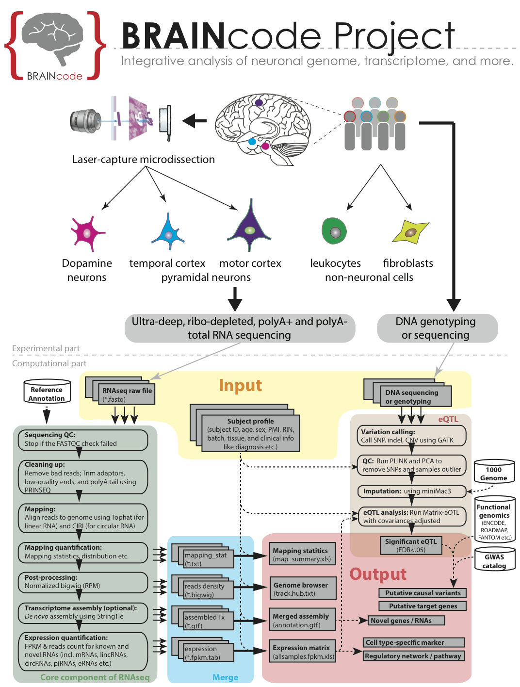

File naming convention
---------------
To standardlize the process, we strongly suggest to start with universal file naming format. In this pipeline, we will use filename convention as:
`[PD|AD|HD|HC]_[subjectID]_[cellType]_<b#>_<rep#>.[R1|R2].<fq|fastq>.gz`
where,
- Beginning with patient type, PD="Parkinson's disease", AD="Alzhimer's disease", HD="Huntington's disease" and HC="Healthy controls", in 2-letter abbreviation;
- Following with subjectID (NOT lane# or sequencing date), which is unique per subject;
- Following with cell type or tissue short name, e.g. SNDA="Substantial nigra dopamine neuron", MCPY="Motor cortex pyramidal neuron" etc.;
- `b#` and `rep#` are optional, in format of (if any);
 - batch number: `b1`, `b2` etc.
 - replication number (capitalized one for biological rep), e.g. `rep1` is for technique replicate 1, `Rep1` for biological replicate 1
- Use R1 or R2 to tell the two mates of pair-end sequencing data;
- Use zipped fastq;

Folder structure
----------------
For each project (e.g. PDMap), it should have a folder named with project short name and followed by the type of data, such as PDMap_RNAseq, HDPredict_smallRNA etc. 
- rawfiles
  - raw fastq files from sequencing;
  - use soft links for external location or unformated file name
  - log file (readme.txt or Excel)
- filtered
  - filtered files (e.g. adaptor removal/clip)
- run_output 
  - sub-folder per sample (e.g. sample1, sample2 etc.)
    - output of Tophat/Cufflinks/htseq-count runs
    - uniq subfolder for the runs for unique reads only
    - status indication file (.status*) for tracking the progress
- for_display
  - files used for display on UCSC / IGV, such as *.bam, *.bam.bai, *.bw, *.gtf etc.
  - use soft links to the output files
- results
  - result files for integrative analysis, e.g. differential analysis by combining all samples. 
 
Pipeline requirement
--------------------
1. Install programs: `tophat`, `cufflinks`, `bowtie`, `bedtools`, `samtools`, `fastq-mcf`, `fastqc`, and `htseq-count`;
2. Install Jim Kent's executable programms: http://hgdownload.cse.ucsc.edu/admin/exe/;
4. Install R and bioconductor packages: `DESeq2`, `MatrixEQTL`, `SPIA` etc.
3. Add path of the executable programs to the `$PATH`;

Pipeline structure
------------------
![flowchart_rnaseq] (./src/flowchart_rnaseq.png "Flowchart of RNAseq pipeline")

Each sub-module has its own status hidden file (e.g. .status.$modulename.adaptorremoval). To check if any sample not completed at any step, use script below:
```
$grep touch ~/pipeline/modules/_RNAseq.sh | grep -v "#" | sed 's/.*modulename\.//g' | while read i; do echo $i `ll ~/neurogen/rnaseq_PD/run_output/*/.status._RNAseq.sh.$i | wc -l`; done
```

### Main script:
RNAseq.pipeline.sh
- Usage: `RNAseq.pipeline.sh /data/neurogen/rnaseq_PD/rawfiles`
- Function: Main script for submitting RNAseq data analysis jobs to high-properformance computing cluster in batch. For now, it's configured to support only HPC environment with LSF job scheduler.
- Input: absolute path of folder for the raw fastq files
- Output: Tophat/Cufflinks/htseq-count/callSNP etc. runs for each sample using both multiple and unique mappers

### Modules:
#### _RNAseq.sh
- Usage: _RNAseq.sh HC_BN10-39_2.R1.fastq.gz HC_BN10-39_2.R2.fastq.gz
- Function: Routine steps for pair-end RNAseq data
- Input: a pair of fastq files from PE RNAsequencing
- Output: BAM/SAM (from alignment), BED/GTF (from assembly) etc. 

List of sub-moduels in the core script _RNAseq.sh:
```
$ grep touch ~/pipeline/modules/_RNAseq.sh | grep -v "#" | sed 's/.*modulename\.//g'
adaptorremoval 
shortReadsExtract 
shortReadsExtract_stemloop
fastqc
mapping
circRNA
sam2bam
bam2stat
sam2bw
rpm_vs_coverage
cufflinks.multi.denovo
cufflinks 
htseqcount
metaexon
uniq
uniq.sam2bw
uniq.bam2stat
cufflinks.denovo
uniq.bam2annotation
uniq.normalize
uniq.cufflinks.rpkm
uniq.cuffquant.rpkm
uniq.htseqcount
uniq.metaexon
makelinks
```